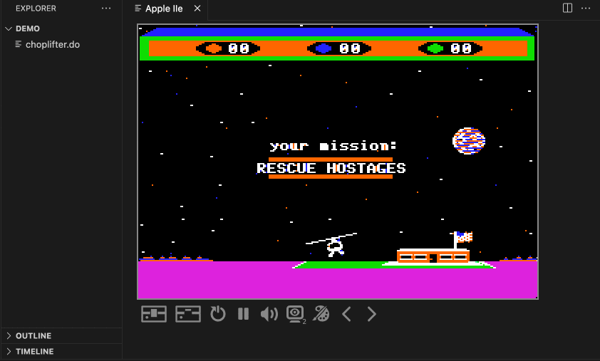
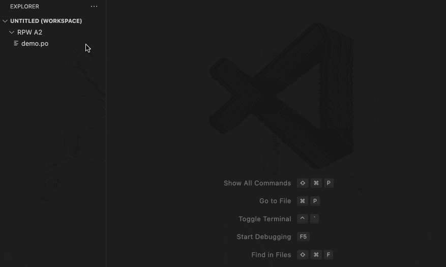
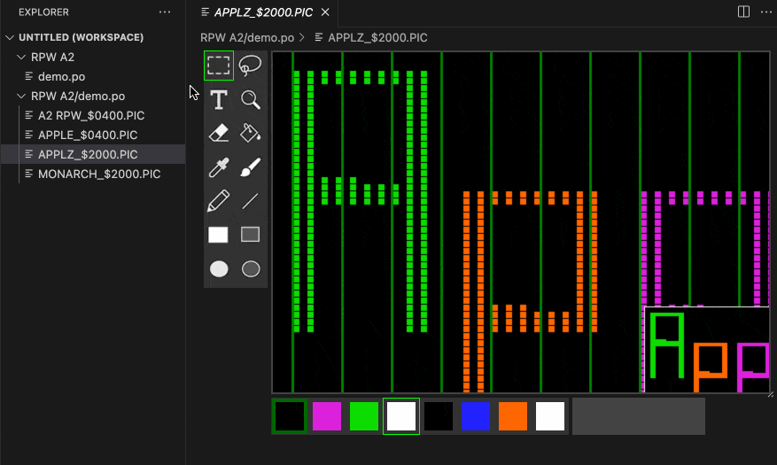

This Retro Programmer's Workshop (RPW) extension provides VSCode support for Apple II emulation, graphics file editing, and file system support for ProDOS and DOS 3.3 disk images.  (See the RPW 65 extension for other related funtionality.)

New for version 3.0: Apple II+ and IIe hardware emulation.

New for version 2.0: Graphics editor support for double-HIRES and double-LORES graphics and a full suite of pixel editing tools.

#### Apple II Emulation

* II+ and IIe (unenhanced) hardware
* Speaker
* 5.25" floppy
* Most display modes
* Mockingboard (partial)
* State snapshots and rewind
* Debugging support with RPW65 extension

##### Known Problems

* Mixed text and grqphics mode not supported
* Disk writing not supported
* Mockingboard support is very limited for now

#### Apple Graphics Editor

##### Editing Tools

##### NOTES

Copying a graphics selection puts that data on the clipboard in text form, ready to be pasted into 6502 source code.  The reverse is also supported, with the extension attempting to determine the dimensions of the data.

#### File System Provider

* Mounts .dsk, .do, .po, .2mg, and .hdv images (.nib and .woz not supported)
* Supports file and folder move, copy, create, delete, and rename
* Displays file contents as text, hex, 6502 disassembly, or graphics (HIRES, LORES, Double HIRES, Double LORES)
* Automatically detokenizes Applesoft and Integer BASIC files to text
* Automatically converts Merlin and LISA v2 source files to text

##### NOTES

New volume images can be created by right clicking and choosing "New File..." in your project.  Name the new file with one of the supported suffixes (.dsk, .po, etc.) and then Mount it.  A non-bootable, empty image will be initialized, ready for files to be added to it.

All write operations are treated as transactions.  The volume is verified before and after any operation.  If verification fails, the operation is rolled back and the volume left unmodified.  That said, back up any important disk image data before modifying with this extension.

This extension has been tested by opening and verifying most images in the Asimov archive.  It will refuse to open any image with any questionable or unknown formatting.  This conservative approach could be relaxed in the future if necessary.

The file conversion functionality in RPW A2 is enough to access old code and graphics, but is not intendend as a general-purpose file export and conversion tool.  For more complete conversion functionality, see tools like Ciderpress.

##### Known Problems

* File system error information such as Disk Full is buried in the VSCode error reporting dialog and not visible without viewing the full message.  It's unclear how to make VSCode display just the relevant information without the extra noise.

###### ProDOS

* Sparse files are not directly supported and will be converted to their expanded form if copied.

###### DOS 3.3

* Non-sequential text files are not supported.
* File names containing the "/" character can't be accessed.
